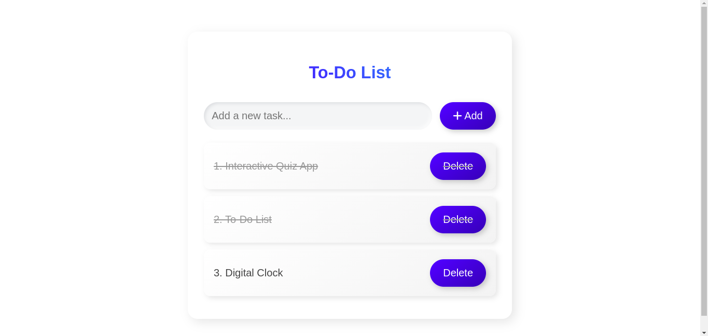

# To-Do List App

This is a simple and elegant To-Do List web app built with HTML, CSS, and JavaScript. The app allows users to add, complete, and remove tasks with a smooth, modern design. It features a gradient background, neomorphic effects, and interactive icons to enhance user experience.

## Features
- **Add tasks**: Users can input new tasks and add them to the list.
- **Complete tasks**: Mark tasks as completed with a strike-through effect.
- **Delete tasks**: Remove tasks from the list.
- **Responsive design**: The app adjusts to fit screens of all sizes, making it mobile-friendly.
- **Interactive icons**: Tasks have buttons with icons for actions such as deleting and completing tasks.
- **Neomorphic design**: Modern and smooth design effects for the interface.

## Screenshots


## Technologies Used
- **HTML5**: Used for creating the structure of the app.
- **CSS3**: Styled the app with modern CSS techniques, including gradients, flexbox, and animations.
- **JavaScript**: Handles the functionality for adding, completing, and removing tasks.
- **Font Awesome Icons**: Used for adding interactive icons for tasks.

## How to Use
1. Clone the repository:
   ```bash
   git clone https://github.com/your-username/todo-list-app.git
2. Open index.html in your web browser to start using the app.
   
## Installation
To run this app locally, you need to have the following:

1. A modern web browser (Chrome, Firefox, etc.).
2. No server-side installation is required as it's a static web app.

Feel free to fork, contribute, and customize the app as you like!

